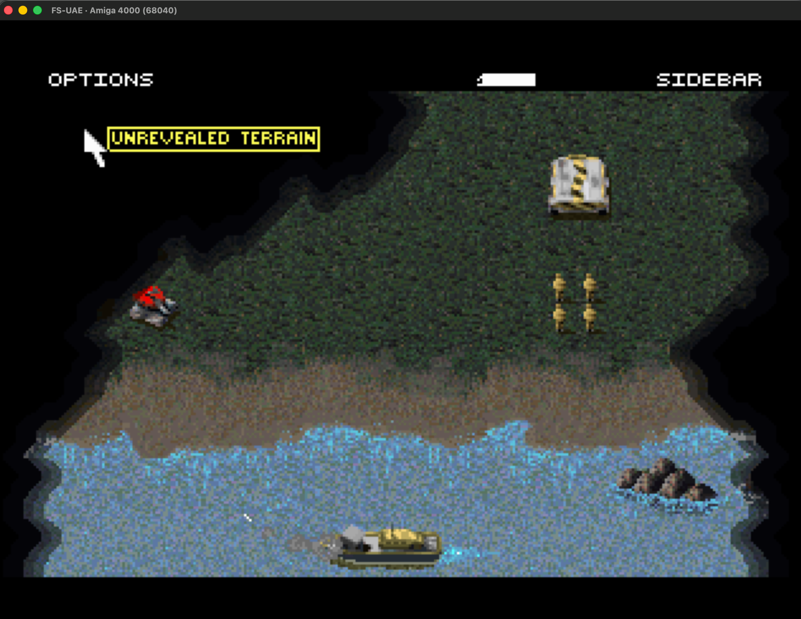
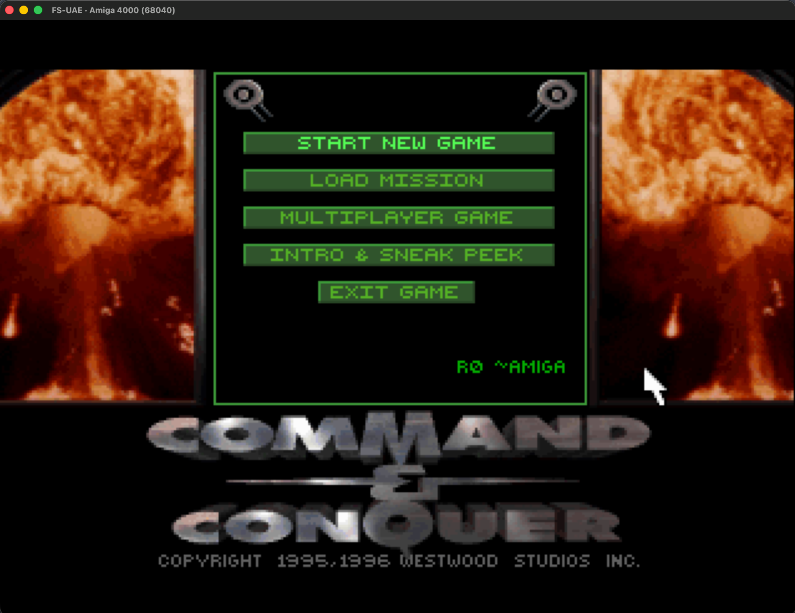

<p align="center">
  
</p>

<p align="center">
  Classic game ports to AmigaOS 3.x (68030+) via <a href="https://github.com/bdgscotland/libSDL2-amigaos3">libSDL2-amigaos3</a>.
</p>

## Ports

| Game | Status | Original Platform | Notes |
|------|--------|-------------------|-------|
| **[Vanilla Conquer](vanilla-conquer/)** (Command & Conquer) | WIP | Windows (1995) | 430K lines of C++11. Menu + GDI Mission 1 loads. No audio. |
| **[1oom](1oom/)** (Master of Orion) | Playable | DOS (1993) | 4X strategy classic. Zero source mods, ~43 FPS. No audio. |
| **[SDLPoP](sdlpop/)** (Prince of Persia) | WIP | DOS (1989) | Renders at ~35 FPS. Keyboard input broken. No audio. |
| **[Julius](julius/)** (Caesar III) | Playable | Windows (1998) | Never on classic Amiga. 360 files, 1 source fix. No audio. |
| **[Celeste Classic](ccleste/)** | Playable | PICO-8 (2018) | First new game on classic 68k Amiga. No audio. |
| **[Chocolate Doom](chocolate-doom/)** | Playable | DOS (1993) | With WAV sound effects via SDL2_mixer. |

### Command & Conquer: Tiberian Dawn

<p align="center">
  
</p>

<p align="center">
  <em>GDI Mission 1 -- terrain, units, buildings, and UI all rendering on AmigaOS 3.x via SDL2.</em>
</p>

<p align="center">
  
</p>

<p align="center">
  <em>Main menu with correct colors. 430,000 lines of C++11 compiled for 68k with bebbo-gcc.</em>
</p>

## Requirements

- [libSDL2-amigaos3](https://github.com/bdgscotland/libSDL2-amigaos3) SDK (v0.7.0+)
- [bebbo-gcc](https://codeberg.org/bebbo/amiga-gcc) cross-compiler (Docker: `amigadev/crosstools:m68k-amigaos`)
- AmigaOS 3.x with RTG (CyberGraphX or Picasso96), 68030+, 128MB Fast RAM recommended
- Original game data files (Caesar III, Doom WAD, etc.)

## Building

Each port has a `Makefile.amiga` that cross-compiles via Docker:

```bash
# Set SDL2_ROOT to your libSDL2-amigaos3 checkout
export SDL2_ROOT=~/Developer/libSDL2-amigaos3

# Build Julius
cd julius
docker run --rm -v $SDL2_ROOT:/sdl2 -v $(pwd):/port -w /port \
  amigadev/crosstools:m68k-amigaos make -f Makefile.amiga SDL2_ROOT=/sdl2
```

## Structure

Each port directory contains only the Amiga-specific build files:
- `Makefile.amiga` -- cross-compilation Makefile
- `amiga/` -- stub files replacing unavailable dependencies
- `patches/` -- modified upstream source files (applied over vendored source)

The upstream game source must be cloned separately per each port's instructions.

## Candidates

See [PORT_CANDIDATES.md](PORT_CANDIDATES.md) for the full researched list of games we can port.

Top picks: REminiscence (Flashback), Another World, OpenTyrian.
